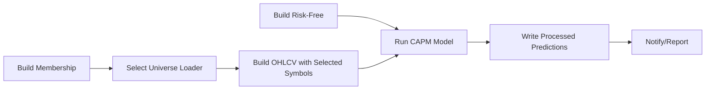

# Qx - A local-first, swappable architecture for financial modeling

Built around three layers—**Data**, **Model**, and **Orchestration**—with strict dataset typing, package-based models, and storage abstraction (Parquet now; Data Lake later).

## High-Level Overview

- **Data Layer:** Ingests raw sources, builds **curated** datasets (Parquet today), and loads curated data by **typed contracts**.
- **Loader Layer:** Reads curated data and transforms to lightweight outputs (lists, parameters, DataFrames) for downstream tasks. **Not persisted**.
- **Model Layer:** Each model is a **package** (`model.py` + `model.yaml`), consumes curated datasets (strict types), generates **processed** outputs with lineage.
- **Orchestration Layer:** Coordinates tasks via a **DAG** (Directed Acyclic Graph). Manages dependencies, runs, and manifests—local runner now; Azure pipelines later.

## Core Principles

- **Typed datasets**: Every curated/processed dataset has a `DatasetType` (domain, asset class, subdomain, region, frequency).
- **Contracts**: `DatasetContract` binds type → schema, partition keys, and a lake-ready `path_template`.
- **Models as packages**: Each model declares IO and parameters in `model.yaml`, and implements logic in `model.py` by extending `BaseModel`.
- **Storage-agnostic**: Backed by `StorageBackend` + `TableFormatAdapter` + `PathResolver`. Swap Parquet→Delta/Iceberg later with no model changes.
- **DAG orchestration**: Tasks form a dependency graph (no cycles). Builders → Models → Post-processing.

## Layer Responsibilities

### Data Layer (Builders)

- **Builders** (`DataBuilderBase`):  
  `raw → transform → curated` (write Parquet under partitioned path templates).
  - Can run **standalone** (populate data lake) OR **in-pipeline** (fetch on demand)
  - Examples: SP500 Membership, Tiingo OHLCV, US Treasury Rates, ESG Scores
- **Contracts & Types**:
  - `DatasetType`: `(domain, asset_class? subdomain, exchange?, frequency?)`
  - `DatasetContract`: `(type, schema_version, required_columns, partition_keys, path_template)`
- **Storage & Paths**:
  - `LocalParquetBackend`: local filesystem Parquet IO.
  - `TableFormatAdapter`: format-level writes (append/overwrite, future compaction).
  - `PathResolver`: renders lake-ready paths from contracts.

### Loader Layer

- **Loaders** (lightweight functions):  
  Read curated datasets by `DatasetType` + partition filters, transform to Python objects.
  - **Input**: Curated datasets (via `TypedCuratedLoader`)
  - **Output**: Lists, Dicts, DataFrames (memory only, **NOT persisted**)
  - **Usage**: Only in DAG pipelines (no standalone use)
  - **Factory**: `run_loader(load_fn, registry, backend, resolver)`
  - **Examples**:
    - `get_continuous_sp500_members()` → List[symbols]
    - `filter_universe_by_market_cap()` → List[symbols]
    - `load_esg_panel()` → DataFrame
- **Key Principle**: Loaders bridge curated data and task parameters. They enable **data-driven pipelines** where Builder inputs come from curated data, not hardcoded values.

### Model Layer

- **BaseModel** (config-driven):  
  Loads `model.yaml`, validates **input types** and **parameters**, runs `run_impl()`, and persists **processed outputs** (Parquet) with run metadata.
- **Model package example**: `qx_models/capm/`
  - `model.yaml`: IO type constraints, parameter defaults/ranges.
  - `model.py`: `CAPMModel(BaseModel)` with feature prep and prediction logic.
- **Processed writer** (`ProcessedWriterBase`):  
  `data/processed/{output_type}/model={model}/run_date=YYYY-MM-DD/part-<run_id>.parquet`.

### Orchestration Layer

- **DAG runner (local)**:
  - `Task(id, run, deps)` executes when dependencies are satisfied.
  - `DAG(tasks).execute()` processes the graph.
- **Three factory functions**:
  - `run_builder()` → Execute builder (write curated data)
  - `run_loader()` → Execute loader (read curated → produce parameters)
  - `run_model()` → Execute model (read curated → write processed)
- **Typical flow**:  
  `BuildMembership → SelectUniverse (Loader) → BuildOHLCV → RunCAPM → Portfolio`.

## Dataset Typing — Examples

- **Curated market data (equities OHLCV):**
  - `DatasetType`:  
    `domain=market-data, asset_class=equity, subdomain=bars, region=US|HK, frequency=D|W|M`
  - Partitions: `(region, frequency, date, exchange)`
- **Curated risk-free (zero curve):**
  - `DatasetType`:  
    `domain=reference-rates, subdomain=yield-curves, region=US|HK, frequency=D`
  - Partitions: `(region, date, curve_id)`
- **Processed predictions (generic):**
  - `DatasetType`:  
    `domain=derived-metrics, asset_class=equity, subdomain=predictions`

## Model Package — `model.yaml` Schema (example)

```yaml
model:
  id: capm
  version: 1.0.0
  featureset_id: ohlcv_v1+rf_v1
  description: "CAPM expected return using daily OHLCV and daily risk-free"

io:
  inputs:
    - name: equity_prices
      required: true
      type:
        domain: market-data
        asset_class: equity
        subdomain: bars
        region: US
        frequency: monthly
    - name: risk_free
      required: true
      type:
        domain: reference-rates
        asset_class: fixed-income
        subdomain: yield-curves
        region: US
        frequency: monthly
  output:
    type:
      domain: processed
      asset_class: equity
      subdomain: predictions
      region: null
      frequency: null

parameters:
  horizon_d:
    type: int
    default: 252
    min: 1
    max: 2520
  beta_method:
    type: enum
    default: "simple"
    allowed: ["simple", "rolling_ols", "exponential"]
```

---

## Storage Abstraction (local-first, swappable)

**Config (`conf/storage.yaml`):**

```yaml
storage:
  backend: local # local | (future: adls)
  base_uri: "file://."
  table_format: parquet # parquet | (future: delta | iceberg)
  write_mode: append
  small_file_compaction_mb: 128
```

**Swap later (example):**

```yaml
storage:
  backend: adls
  base_uri: "abfs://lake@myaccount"
  table_format: delta
  write_mode: append
```

---

## Orchestration — DAG Concept

- **Directed Acyclic Graph (DAG):** a set of tasks with one-way dependencies and **no cycles**.
- **Why DAGs:** clarity of execution order, reproducible runs, easy parallelization, and audit-friendly lineages.
- **Local runner:** lightweight Python DAG class; production can swap to Azure Data Factory / AML Pipelines / Durable Functions later.

## Folder Structure

```
qx/                          # Core framework (infrastructure)
  ├── common/               # Types, contracts, predefined registry
  ├── storage/              # Backends, format adapter, path resolver
  ├── foundation/           # Base classes (base_builder, typed_loader)
  ├── engine/               # Model base, processed writer
  ├── orchestration/        # DAG, tasks, factories (run_builder, run_loader, run_model)
  └── utils/                # Utilities (universe.py - loader functions)

qx_builders/                # Builder implementations (outside framework)
  ├── sp500_membership/    # builder.py + builder.yaml
  ├── tiingo_ohlcv/        # builder.py + builder.yaml
  ├── us_treasury_rate/    # builder.py + builder.yaml
  └── esg_score/           # builder.py + builder.yaml

qx_models/                  # Model implementations (outside framework)
  ├── esg_factor/          # model.py + model.yaml
  ├── market_beta/         # model.py + model.yaml
  └── factor_expected_returns/  # model.py + model.yaml

conf/
  └── storage.yaml          # Select backend/format

(Loaders are functions in qx/utils/, not packages)
```

## Migration Path (local → lakehouse → cloud)

1. **Today (local dev):** Parquet on filesystem; run local DAG; iterate on model packages quickly.
2. **Lakehouse:** Implement an ADLS backend + Delta adapter; keep path templates; add compaction/OPTIMIZE.
3. **Cloud orchestration:** Replace local DAG with Azure services (Data Factory, AML pipelines, Durable Functions). No changes to model packages required.

## Glossary

- **Curated data:** Cleaned, typed, partitioned datasets ready for modeling (e.g., OHLCV, RFR, fundamentals).
- **Processed data:** Model outputs (predictions, portfolios, risk metrics) with run lineage.
- **Loader:** Lightweight function that reads curated data and transforms to parameters/datasets (memory only, not persisted).
- **DatasetType:** Identity tuple of a dataset (domain, subdomain, exchange, frequency…).
- **DatasetContract:** Schema + partitions + path rendering rules for a dataset type.
- **DAG:** Directed Acyclic Graph; task dependency graph for orchestration.

## Architecture Rules

### ✅ Allowed Data Flows

- `BUILDER (standalone) → CURATED DATA`
- `LOADER → parameters (List, Dict, DataFrame)`
- `LOADER → BUILDER (passes parameters)`
- `LOADER → MODEL (passes data)`
- `BUILDER → CURATED → LOADER`
- `MODEL → PROCESSED → MODEL (chain processing)`

### ❌ Prohibited Flows

- `MODEL → BUILDER` ❌ (violates layer separation)
- `LOADER → CURATED` ❌ (loaders don't persist)
- `BUILDER → PROCESSED` ❌ (builders write curated only)

## Quick Tips

- Keep `subdomain` names stable (e.g., `bars`, `yield-curves`, `fundamentals_income`).
- Version schemas via `schema_version` folder segments (e.g., `schema_v1`)—never mutate history.
- Always write **immutable processed outputs** (new `run_id` partitions); **do not overwrite**.
- Enforce strict input types in **`model.yaml`** to achieve true **lego-style** composition.
- **Use Loaders** to bridge curated data and builder parameters—avoid hardcoding symbols/universes.
- **Never pass Model outputs to Builders**—maintain one-way data flow (raw → curated → processed).

## Loader Pattern Examples

### Example 1: Select Continuous Universe

```python
# Loader function (qx/utils/universe.py)
def get_continuous_sp500_members(loader, start_date, end_date):
    df = loader.load(
        dt=DatasetType(domain=Domain.MEMBERSHIP, subdomain="sp500_membership_intervals"),
        partitions={"universe": "sp500", "mode": "intervals"}
    )
    continuous = df[(df['start_date'] <= start_date) & (df['end_date'] >= end_date)]
    return continuous['symbol'].unique().tolist()

# DAG usage
Task(
    id="SelectUniverse",
    run=run_loader(load_fn=get_continuous_sp500_members, ...),
    deps=["BuildMembership"]
)

Task(
    id="BuildOHLCV",
    run=lambda ctx: run_builder(
        "qx_builders/tiingo_ohlcv",
        overrides={"symbols": ctx["SelectUniverse"]["output"]}
    )(),
    deps=["SelectUniverse"]
)
```

### Example 2: Load ESG Panel for Model

```python
def load_esg_panel(loader):
    return loader.load(
        dt=DatasetType(domain=Domain.ESG, subdomain="esg_scores"),
        partitions={"exchange": "US"},
        filters={"year_range": (2014, 2024)}
    )

Task(id="LoadESG", run=run_loader(load_fn=load_esg_panel, ...), deps=["BuildESG"])
Task(id="RunESGFactor", run=run_model("qx_models/esg_factor", ...), deps=["LoadESG"])
```

### Appendix — Updated Task Flow (with Loaders)



**See also**:

- `docs/LOADER_PATTERN_GUIDE.md` - Complete guide to Loader pattern
- `docs/ARCHITECTURE_LAYERS_QUICK_REF.md` - Quick reference for all layers
- `examples/builder_dag_with_loader.py` - Working example with universe selection
- `qx/utils/universe.py` - Universe selection utilities
